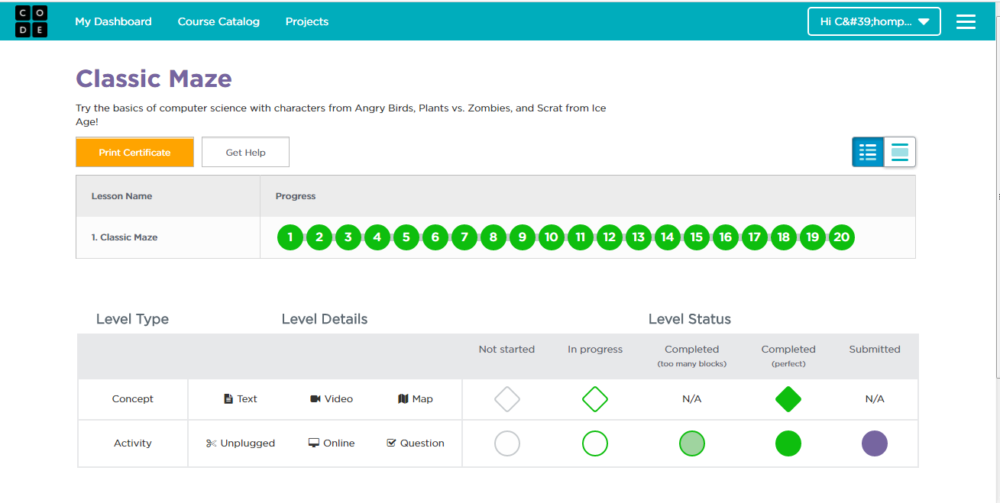
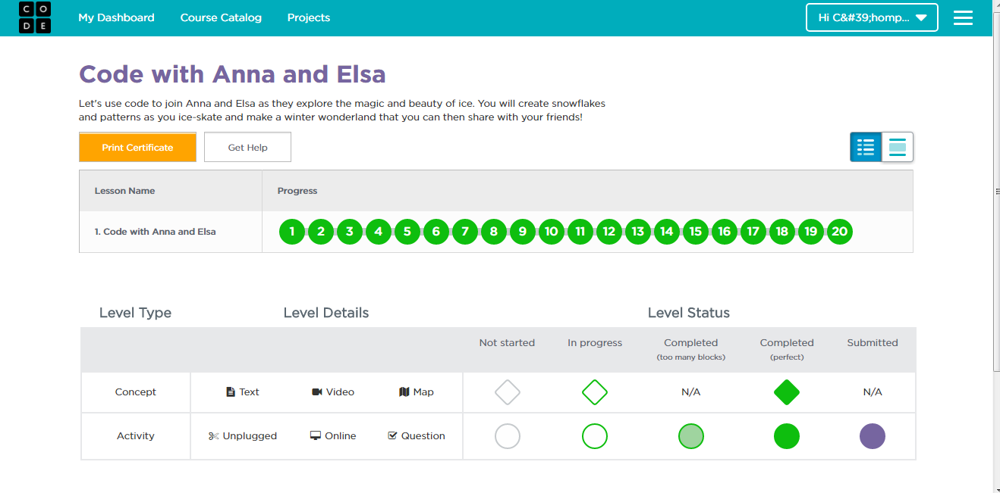
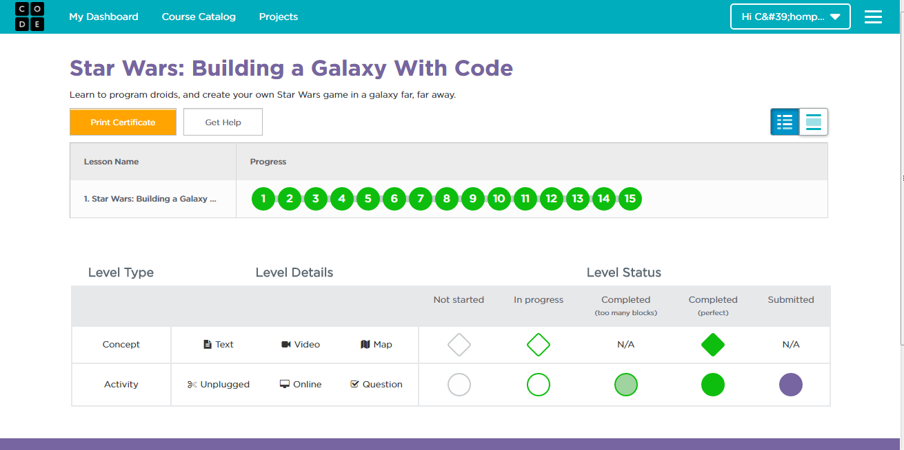
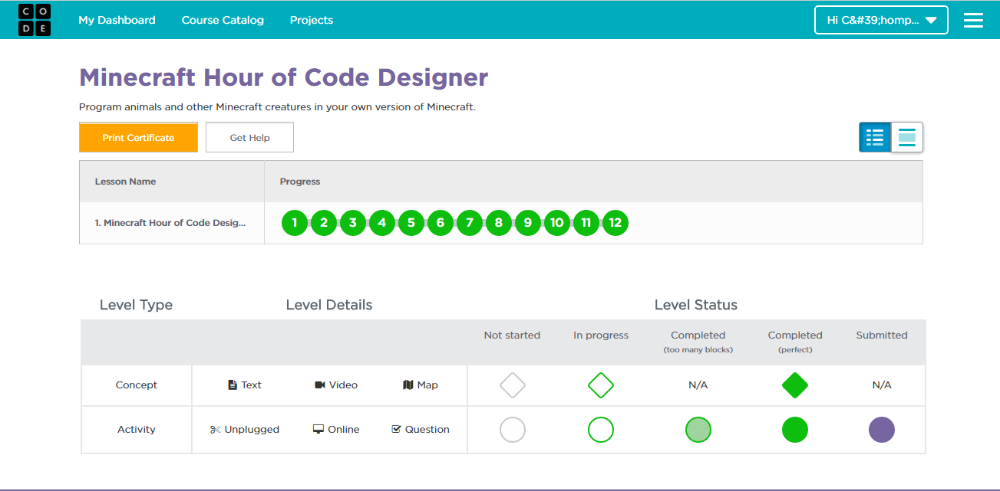

# tp_prog_week3
งานครั้งที่ 4 วิชาการเขียนโปรแกรมคอมพิวเตอร์ ปวส1

## วิธีการส่งงาน

1.  บันทึกหน้า dashboard ของแต่ละกิจกรรม
2.  **ตั้งชื่อตามนี้**
    -  Angry Bird เป็น lab1.png
    -  Frozen เป็น lab2.png
    -  Star wars เป็น lab3.png
    -  Minecraft เป็น lab4.png
3.  อัพทั้ง 4 รูปไว้ใน folder img (เมื่อสำเร็จไฟล์จะมีภาพปรากฎ)
4.  เขียนสรุปสิ่งที่ได้ด้วย

------------------------------------------

## กิจกรรมทดลอง Angry bird

### ภาพยืนยันความสมบูรณ์ (3 points)

### สรุปสิ่งที่ได้เรียนรู้จากกิจกรรม (2 points)

$$$$1

มีการใช้คำสั่ง repeat 5 times do..เพื่อให้ตัว angry bird เดินไปข้าง 5 ครั้งเพื่อทำลายตัวหมูสีเขียว ได้สร้างคำสั่งให้ตัวการ์ตูนเดินไปข้างหน้าถ้าไม่มีทางให้เดินให้เปลี้ยนไปเดินอีกทางหนึ่ง ใช้ repeat until do ซ้อนวอลลูปอีกชั้นเพื่อเพิ่มตัวคำสั่งให้ทำซ้ำอีกครั้งหลังจากที่เดินไปแล้วถ้าไม่มีทางให้เลี้ยวให้เปลี่ยนไปเดินอีกทางแล้วทำการวอลลูปคำสั่งเดิมเพื่อให้ถึงเป้าหมาย

1$$$$

-------------------------------------------

## กิจกรรมทดลอง Frozen

### ภาพยืนยันความสมบูรณ์ (3 points)

### สรุปสิ่งที่ได้เรียนรู้จากกิจกรรม (2 points)

$$$$2

ได้รู้จักการใช้วอลลูป วอลลูปสามารถซ้อนกันได้ ได้ใช้คำสั่งต่างๆในการแก้ปัญหาเพื่อผ่านด่านต่างๆ ได้ใช้คำสั่งCreate a snowflake branch เพื่อทำให้ Elsa เดินเป็นเส้นรูปหิมะ ใช้คำสั่งสร้างให้ Elsa เดินเป็นรูป 4 เหลี่ยมหลายๆครั้งเพื่อสร้างเป้นรูปดอกไม้ โดยการใช้คำสั่งวอลลูปซ้อนวอลลูป

2$$$$

------------------------------------------

## กิจกรรมทดลอง Star wars

### ภาพยืนยันความสมบูรณ์ (3 points)

### สรุปสิ่งที่ได้เรียนรู้จากกิจกรรม (2 points)

$$$$3

สร้างคำสั่งให้โรบอลเดินไปเก็บเศษเหล็กตามที่โจทย์กำหนด สร้างคำสั่งให้โรบอลเดินไปฆ่าตัวอื่นเพื่อเก็บคะแนน ถ้าโดนตัวอื่นฆ่าก่อนก็จะตายไม่ผ่านไปด่านอื่น สร้างคำสั่งเพิ่มตัวเมาส์หนูขึ้นมาถ้าตัวโรบอทเดินไปเก็บตัวเมาส์หนูตัวแรกได้ก็จะเกิดตัวเมาส์หนูเพิ่มขึ้นมาอีก ทำซ้ำด้วยคำสั่งวอลลูป

3$$$$

-------------------------------------------

## กิจกรรมทดลอง Minecraft

### ภาพยืนยันความสมบูรณ์ (3 points)

### สรุปสิ่งที่ได้เรียนรู้จากกิจกรรม (2 points)

$$$$4

สร้างคำสั่งในการเก็บน้ำนมวัว ทำให้ตัวละครเดินไปฆ่าตัวอื่นเพื่อเก็บ scor เพื่อผ่านไปด่านต่อไป

4$$$$

-------------------------------------------

## สรุปคะแนน

| Topic          | Score           |
| :------------- | :-------------: |
| Angry Bird 1   |                 |
| Angry Bird 2   |                 |
| Frozen 1       |                 |
| Frozen 2       |                 |
| Star wars 1    |                 |
| Star wars 2    |                 |
| Minecraft 1    |                 |
| Minecraft 2    |                 |

**รวม :** 0 คะแนน
